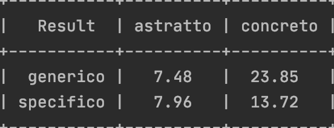

# TLN1920

## Consegna

Dati 4 termini differenziati in base alla loro concretezza e specificità:
- building --> [Concreto][Generico]
- molecule --> [Concreto][Specifico]
- freedom --> [astratto][Generico]
- compassion --> [astratto][specifico]

E circa 20 definizioni diverse per ogni termine.

1. Caricamento dei dati sulle definizioni (file definizioni.xls o google doc presente su
Moodle)
2. Preprocessing (su frequenza minima dei termini, stemming, etc. a vostra scelta)
3. Calcolo similarità tra definizioni (cardinalità dell’intersezione dei termini
normalizzata su lunghezza minima tra le due, o varianti a scelta)
4. Aggregazione sulle due dimensioni (concretezza / specificità come da schema in
basso)
5. Interpretazione dei risultati e scrittura di un piccolo report (da inserire nel vostro
portfolio per l’esame

### Svolgimento

I dati sono salvati in una matrice dove le righe indicano i diversi concetti e le colonne tutte le diverse definizioni per ogni concetto.
Sono state realizzate 2 strutture dati per poter eseguire calcoli statistici sulla matrice di dati:
  - **sts_all_defs** --> `k -> [(t1,f1), ..]` una mappa dove:
       - **Key**: k rappresenta il termine da descrivere (Esempio k = **concreto_generico_building : building**)
       - **Value**: la lista di coppie **(t1,f1)** dove t1 è un qualsiasi termine usato per descrivere k e f è il numero di occorrenze del termine t in ogni definizioni di k.
       
  - **topic_single_def** --> `k -> [d1(t1,t2...), d2(t1,t5 ..) ... d20(..) ]` realizzata a partire da **sts_all_defs** una mappa dove:
       - **Key**: k rappresenta il termine da descrivere
       - **Value**: `[d1(t1,t2...), d2(t1,t5 ..) ... d20(..) ]` è una lista di liste di termini. In ogni elemento i-esimo ci sono i termini usati nella definizione i-esima per descrivere k.

In questa fase i termini hanno già subito il preprocessing (lemmatizzazione + rimozione stopword). 
I termini in ogni lista sono ordinati in base alla loro frequenza in ogni definizione usata per descrivere uno stesso termine. 

La similarità tra le definizioni di uno stesso termine **k** è come segue:
1. Da **topic_single_def** vengono estratte tutte le liste di parole associate al termine k. 
2. Per ogni coppia di definizione viene calcolato l'intersezione tra le 2 (nonchè i termini che condividono), indichiamo questo valore con **s**. 
Se i 2 insiemi hanno cardinalità diversa essa viene normalizzata sulla lunghezza minima dei 2. I termini più rilevanti vengono mantenuti grazie all'ordinamento effettuato in precedenza.
3. La similarità delle definizioni per il termine **k** è uguale alla medie delle similarità **s** per ogni coppia di definizioni che descrivono **k**.

###
Risultati

I risultati sono poi illustrati in una prettytable (come visibile sottostante)

  

Di seguito una variante dei valori di similarità ottenuta effettuando stemming delle parole nelle definizioni invece che lemmatizazzione.
 

  

