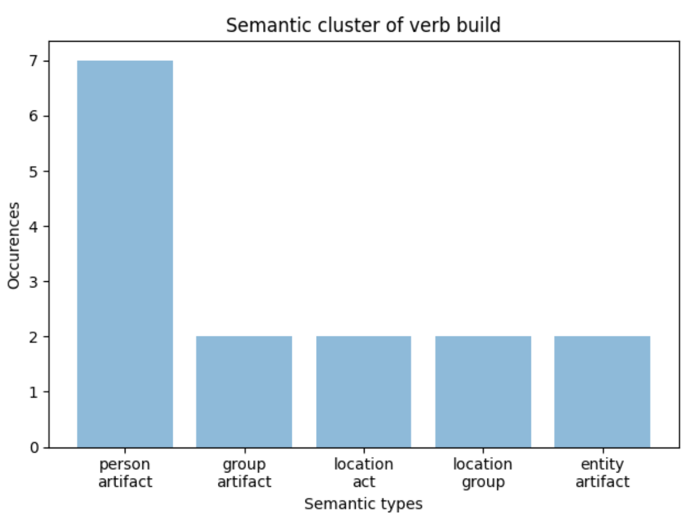
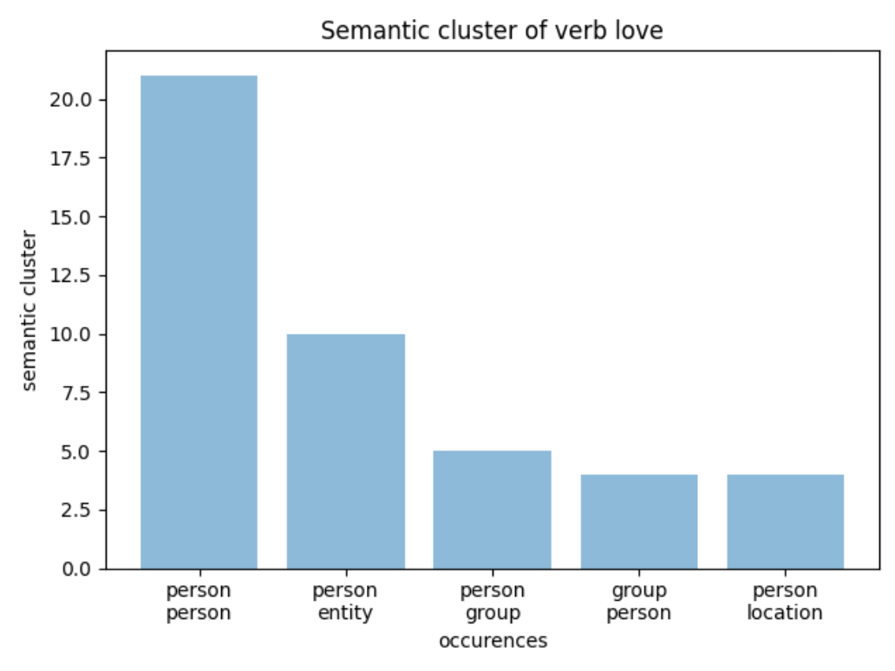

# TLN1920

## Consegna

Implementazione teoria di P. Hanks
1. Scegliere un verbo transitivo (min valenza = 2)
2. Recuperare da un corpus n istanze in cui esso viene usato
3. Effettuare parsing e disambiguazione
4. Usare i super sensi di WordNet sugli argomenti (subj e obj) del verbo scelto
5. Aggregare i risultati, calcolare le frequenze, stampare i cluster semantici ottenuti
 - Un cluster semantico è inteso come combinazione dei semantic types (ad esempio coppie di sem types se valenza = 2)

### Svolgimento

1. Sono stati utilizzati i verbi:
 - `build`
 - `love`
 - `eat`
 
2. Per recuperare n frasi in cui viene usato il verbo selezionato è stato utilizzato il corpus brown. 
Dato che la forma della parola relativa al verbo cambia in base alla coniugazione di quest'ultimo è stato necessario l'utilizzo del lemmatizzatore di Wordnet.
Iterando su tutte le parole di una singola frase, per ogni parola viene calcolato il lemma e se è uguale alla forma base del verbo scelto la frase viene salvata. 
3. Per ogni frase, con l'ausilio di `spacy`, viene effettuato il pos + parsing, ottenendo i vari token collegati tramite dipendenze sintattiche.
Iterando su tutti i token è possibile estrarre il **soggetto** e il **complemento oggetto** relativi al verbo della frase, in quanto sono token figli del token del verbo a cui sono legati. 

4. **Soggetto e Complemento oggetto** vengono mappati con i relativi super sensi di Wordnet nel seguente modo:
- ***Nome proprio***: person
- ***Pronome*** : [I, you, she, he, we, they] : person oppure [It] : entity
- ***Parola generica***: viene utilizzato il WSD che data la frase e il termine generico tenta di restituire il senso del termine

5. I supersensi di **Soggetto** e **complemento oggetto** rappresentato rispettivamente i filler1 e filler2 dei verbi (in quanto tutti e 3 i verbi hanno valenza 2), le combinazioni dei tipi semantici sono salvati nei semantic cluster.
- **Semantic cluster** contiene tutte le coppie **super_sense_subj:super_sense_dobj** estratte dalle frasi.

5. Vengono calcolate la frequenze dei coppie supersensi, ottenendo così per Filler1 e Filler2 i supersensi più frequenti.

I **cluster semantici** ottenuti sono visibili nei grafici sottostanti con le relative frequenze

### Risultati

**Semantic Type for verb BUILD**

  

**Semantic Type for verb LOVE**

  

**Semantic Type for verb EAT**

  

Come si può vedere la coppia più frequente è quella più significativa per il significato del verbo:
- (<person:person> : 20) per il verbo amare
- (<person:food> : 7) per il verbo mangiare
- (<person:artifact> : 7) per il verbo costruire

Alcune coppie di semantic type, quella con frequenza minore, possono essere poco significative per il verbo in esame, ma questo può essere dovuto all'accuratezza del WSD che è pari al **68%**.