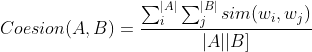
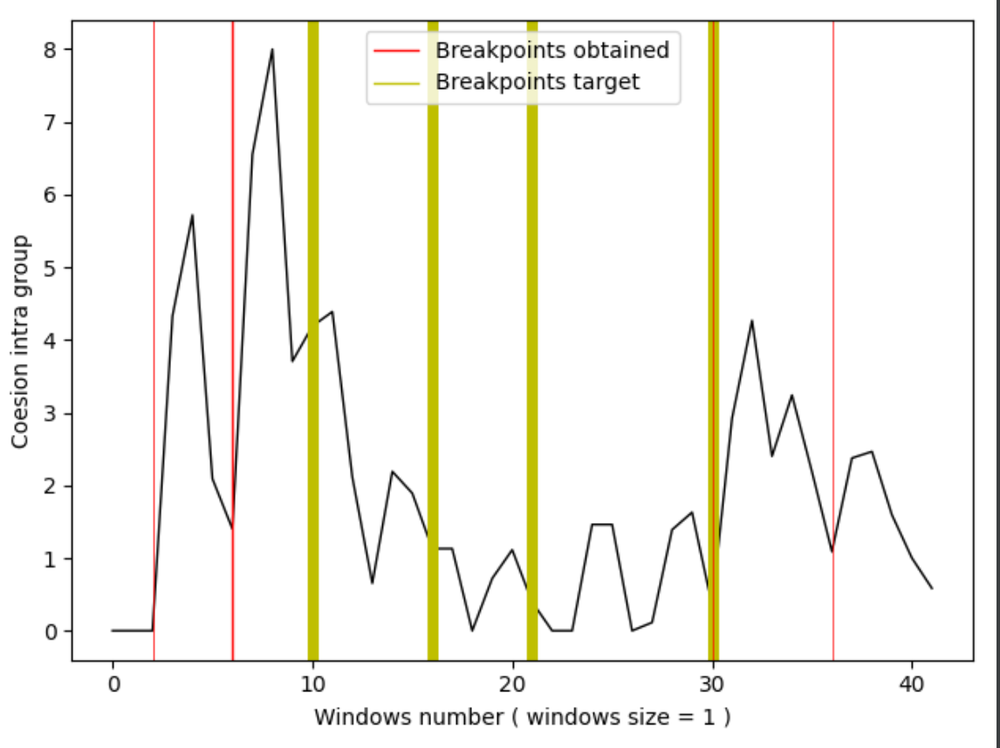
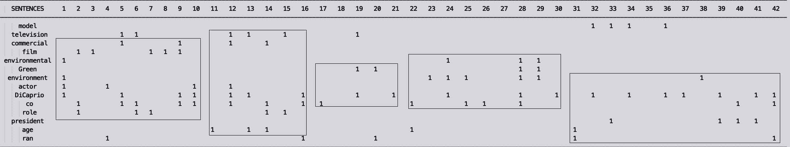

# TLN1920

## Consegna

Ispirandosi al Text Tiling, implementare un algoritmo di segmentazione del testo. Usando informazioni come frequenze (globali, locali),
co-occorrenze, risorse semantiche (WordNet, etc.), applicando step di preprocessing (as usual), etc. 

### Svolgimento

Il task è stato realizzato eseguendo i seguenti step:
 1. Windowing + Tokenizing
    - Trasformazione del testo in un insieme di **N** frasi.
    - Le frasi vengono raggruppate in finestre di lunghezza fisse, specificata dal parametro `size_windows`, ottenendo così **N/size_windows** finestre della stessa lunghezza.
    - Ogni finestra viene 'tokenizzata' trasformando l'insieme di frasi al suo interno in una lista di parola rilevanti.
 2. Coesion ranking
    - Per ogni finestra i-esima viene valutata la similarità intragruppo.
        - La media fra la similarità tra la finestra i-1 e i e quella fra la finestra i e i +1
 3. Search Break Point
    - Ricerca dei punti a bassa coesione circondanti da quelli ad alta coesione.
 
Saranno ora descritti i 3 step con maggiore dettaglio.

## 1. Windowing + Tokenizing

Il testo viene letto da file e trasformato in una lista di frasi, successivamente le frasi vengono raggurppate in finestre di lunghezza fissa e la cardinalità di ogni finestra è data dal parametro `size_windows`.
Lo step successivo è quello di estarre i termini rilevanti in ogni finestra filtrando stop_word e rimuovendo i vari simboli di punteggiare.

La struttura dati risultati è una lista di finestra in cui in ogni elemento i-esimo sono presenti i termini rilevanti per la finestra i-esima.

## 2. Coesion ranking

Lo scopo di questo step è quello di calcolare la coesione di una finestra rispetto a quelle adiacenti (in quella precedente e in quella successiva), sulla base dei termini rilevanti presenti in ogni finestra. 

Il valore di coesione di una finestra è dato da quanto le parole che occorrono nella finestra sono semanticamente simili alle parole che occorrono in quelle adiacenti, di conseguenza per ogni coppia di finiestre adicenti è stata colcolata la similarità semantica per coppia di parole presenti nelle finestre. 
Date le finestre **A** e **B** il valore di coesione è dato dalla seguente formula:

  

Dove le due sommatorie iterano su ogni combinazione di parole presenti nelle finestre e **sim(a,b)** è il valore di similarità fra parola a e b.
E' stata utilizzata come misura di similarità fra parole la **Weighted Overlap**: basato sulla versione **Lexical** di NASARI.
 
Il valore di similarità per la finestra i-esima viene calcolata come **media** dei seguenti valori:
 - similarità tra la finestra i e i + 1
 - similarità tra la finestra i e i - 1  

#### Weighted Overlap

Il programma effettua parsing della versione Lexical di NASARI mantenendola in memoria per accedere alla rappresentazione vettoriale di una parola quando viene coinvolta nel calcolo della misura di similarità.

Per ogni finestra (corrente, precedente e successiva) vengono estratti i relativi vettori Nasari, ovvero una lista di vettori relativi a tutte le parole rilevanti presenti nella finestra.
Dato i vettori v1 e v2 viene calcolata l'intersezione tra i 2 e valutato il rank degli elementi comune, la formula è la seguente:

  

## 3. Search Break Point

Per determinare i punti in cui dividere il testo, in modo da determinare i paragrafi, si scorre la lista contenente i valori di coesione `similarities`. 
Una finestra è un buon candidato per un punto di split point se il suo valore di coesione è minore rispetto la media dei valori totali e se la somma delle similarità della finestra successiva e precedente è elevata. 

Si cerca il miglior candidato, ovvero fra tutte le finestre con un valore di similarità basso (sotto la media) si prende quella, la cui somma di similarità delle finestre adiacente è massima.
L'algoritmo procede iterativamente andando ad estarrre ad ogni iterazione il miglior minimo, la condizione di stop è che non ci sono più 'migliori minimi' da estrarre oppure è riuscito a trovare il numero target di split points.

### Risultati

Il testo utilizzato è un breve biografia dell'attore Leonardo Di Caprio, presente in `utils/dicaprio_life.txt`.

Sono stati effettuati diversi esperimenti variando la dimensione delle finestre.
Nella variabile `break_point_sentence_target` ci sono gli indici delle frasi che indicano il cambio di discorso all'interno del testo.

Di seguito sono indicati i risultati dei vari esperimenti:
- **riga rossa : split points target**
- **riga gialla: split point ottenuto**

Durante l'esecuzione del programma gli indici nella variabile `break_point_sentence_target` vengono divisi per il numero di frasi per finestra in modo da identificare a grandi linee in quale finestra è presente la frase che indica il cambio del discorso.

Di conseguenza i valori di `break_point_sentence_target` possono anche essere decimali, e se nel grafico la linee gialla è molto vicina a quella rossa il programma, in questa particolare configurazione delle finestre, non poteva arrivare ad una soluzione più corretta. (In quanto la frase che genera il salto del discorso è interna ad una finestra). 
 

  

  

  

  

  

Come si può vedere la grandezza ideale di una finestra, per questo testo, è di 4 unità, con questa configurazione il programma riesce ad inferire 3 break point corretti su 4.

E’ anche stato realizzato un metodo che dal testo costruisce una matrice dove sulle:
- righe : sono indicati i termini rilevanti (non stop word e non numeri) con occorrenze totale nel testo maggiore di 3
- colonne : indici delle frasi all’interno del testo
 - celle(i, j): occorrenza parola della riga i nella frase con indice j

  

Come si può vedere in figura, in questo testo i cambi di discorso non sono troppo evidenti in quanto le parole usate non variano molto da una finestra ad un’altra.

NOTA: per eseguire il programma è necessario che in utils ci sia la versione lexical di NASARI (in questa versione sono presenti 10 feature per ogni item) disponibile al seguente url: 
•	https://goo.gl/85BubW
